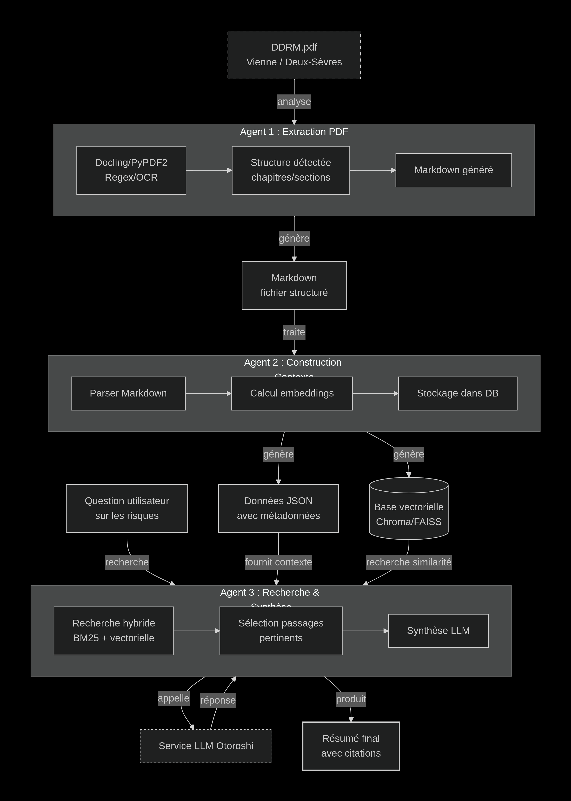

# StarTech - Système RAG Multi-Agents pour l'Analyse des Risques Majeurs

Application de Retrieval-Augmented Generation (RAG) multi-agents conçue pour l'analyse intelligente des Documents Départementaux sur les Risques Majeurs (DDRM) de la Vienne et des Deux-Sèvres.

## Présentation

Ce projet combine une architecture multi-agents avec les technologies modernes de traitement du langage naturel pour permettre aux utilisateurs d'interroger facilement des documents techniques complexes sur les risques naturels et technologiques.

Le système extrait, indexe et analyse les documents PDF des DDRM, puis répond aux questions des utilisateurs en fournissant des réponses sourcées et contextualisées.

## Architecture



Le système repose sur trois agents spécialisés qui travaillent en séquence :

**Agent 1 - Extraction PDF**
- Analyse les documents PDF avec Docling et PyPDF2
- Détecte la structure (chapitres, sections)
- Génère des fichiers Markdown structurés

**Agent 2 - Construction du Contexte**
- Parse les fichiers Markdown générés
- Calcule les embeddings avec Sentence-Transformers
- Stocke les vecteurs dans ChromaDB/FAISS

**Agent 3 - Recherche et Synthèse**
- Effectue une recherche hybride (BM25 + vectorielle)
- Sélectionne les passages pertinents
- Génère une réponse via Ollama (LLM local)

## Structure du Projet

```
project/
├── Back end/
│   ├── agents/
│   │   ├── agent_1_extraction/      # Extraction PDF
│   │   ├── agent_2_context/         # Construction contexte
│   │   └── agent_3_synthesis/       # Recherche et synthèse
│   ├── config/                      # Configuration
│   ├── core/                        # Composants partagés
│   ├── workflow/                    # Orchestration LangGraph
│   ├── utils/                       # Utilitaires
│   ├── api.py                       # API FastAPI
│   └── main.py                      # Point d'entrée CLI
│
├── front end/
│   ├── app/                         # Pages Next.js
│   ├── components/                  # Composants React
│   └── lib/                         # Utilitaires
│
└── data/                            # Documents DDRM
```

## Technologies

### Backend
- Python 3.10+
- FastAPI
- LangGraph / LangChain
- Sentence-Transformers
- ChromaDB
- Docling

### Frontend
- Next.js 16
- React
- TypeScript
- Tailwind CSS

## Installation

### Backend

```bash
cd "Back end"

# Créer l'environnement virtuel
python -m venv venv
source venv/bin/activate

# Installer les dépendances
pip install -r ../requierement.txt

# Configurer les variables d'environnement
cp .env.example .env
```

### Frontend

```bash
cd "front end"

# Installer les dépendances
npm install

# Lancer en développement
npm run dev
```

## Configuration

Créer un fichier `.env` dans le dossier Backend avec les variables suivantes :

```env
OLLAMA_API_URL=http://localhost:11434
OLLAMA_MODEL=llama3.2:1b
EMBEDDING_MODEL=sentence-transformers/all-MiniLM-L6-v2
CHUNK_SIZE=1000
CHUNK_OVERLAP=200
```

## Utilisation

### Ligne de commande

```bash
# Indexer un document
python main.py --index data/DDRM_vienne_86.pdf

# Poser une question
python main.py --query "Quels sont les risques d'inondation dans la Vienne?"

# Mode interactif
python main.py --interactive
```

### API REST

```bash
# Se placer dans le dossier Backend
cd "Back end"

# Démarrer le serveur
uvicorn api:app --reload --port 8000
```

Endpoints disponibles :
- `POST /ask` - Poser une question
- `GET /health` - Vérifier l'état du service
- `GET /status` - Obtenir les statistiques

### Utilisation programmatique

```python
from workflow import create_rag_workflow

workflow = create_rag_workflow()

# Indexer des documents
workflow.index_documents(["data/DDRM_vienne_86.pdf"])

# Poser une question
response = workflow.query("Quels sont les risques majeurs?")
print(response.answer)
```

## Fonctionnalités

### Extraction PDF
- Extraction de texte avec Docling
- Détection automatique de la structure
- Support OCR pour documents scannés
- Génération de Markdown structuré

### Recherche Hybride
- Recherche lexicale BM25
- Recherche vectorielle avec embeddings
- Fusion des résultats (Reciprocal Rank Fusion)

### Synthèse Intelligente
- Génération de réponses contextualisées
- Citations avec références aux sources
- Score de confiance


